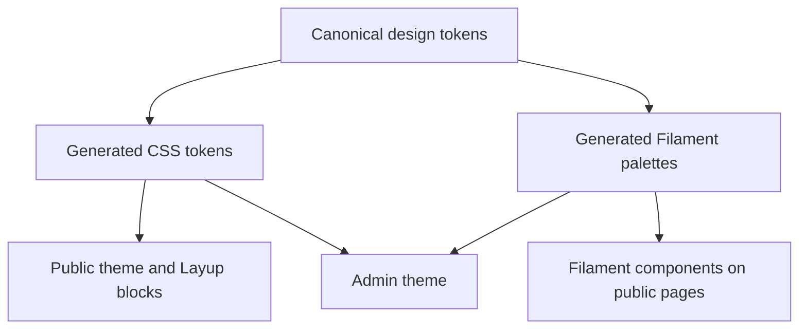

# MAMIAS redesign proposal

Status: proposed, 26 September 2026. Planning only; no application changes.

## Direction: a Mediterranean scientific atlas

Make MAMIAS feel like a trustworthy research publication with practical data tools: clear scientific names, precise metadata, restrained marine colors, readable maps, and obvious next actions.

One identity serves two distinct jobs:

- **Public website:** discover species and records, understand evidence, explore geographic patterns, and contribute observations.
- **Admin panel:** review submissions, maintain taxonomy, assess evidence, and manage imports efficiently.

Retain Laravel, Filament 5, Livewire, Tailwind 4, the Keenthemes public shell, and Layup. Preserve the `/mamias` panel, authentication, role restrictions, existing routes, and service integrations. This is an evolution of `DESIGN-SYSTEM.md`, not a new brand or framework migration.

## 1. What the source audit establishes

This is a source audit, not a completed browser or accessibility audit. Published Layup content, actual data volumes, and rendered screens still need inspection. Existing uncommitted application changes must be preserved.

| Finding | Evidence | Planned response |
|---|---|---|
| A strong visual foundation already exists | `DESIGN-SYSTEM.md`, both stylesheets, panel provider: Geist, teal, square corners, hairline borders | Keep these decisions; improve hierarchy and consistency |
| Tokens are copied between CSS and PHP | `app.css`, `AppServiceProvider`, `MamiasPanelProvider`; the design document describes manual synchronization | Introduce one token source and explicit adapters |
| Documentation has drifted | The design document describes an older shell; current public templates describe a condensed header | Reconcile documentation against the rendered implementation |
| Phone access is blocked | Public layout mobile notice; panel mobile notice hides main content below 48rem | Replace blanket blocking with responsive screens, verified before removing notices |
| Public navigation is nested | `partials/navbar.blade.php` nests dashboards and resources | Flatten the most frequent exploration paths |
| Dashboard prioritizes analysis | `Dashboard.php` opens catalogue/data tabs containing statistics and charts | Add a work overview; retain analytical views |
| Existing tables already have useful responsive behavior | `TaxonTable.php` has responsive columns, filters, grouped actions, deferred loading | Refine these patterns instead of rebuilding tables |
| Seeded home content is generic | `LayupHomePageSeeder.php` includes four placeholder slides, inline gradients and generic CTA treatments | Replace with an evidence-led homepage; first compare with published content |
| Dark mode is incomplete across surfaces | Public dark tokens exist; panel explicitly sets `darkMode(false)` | Finish public dark coverage first; stage panel dark support after component checks |
| Public landmark markup needs correction | `app.blade.php` uses `role="content"` on `<main>`; no skip link found in that shell | Use native landmarks and add a visible-on-focus skip link |
| Scientific and workflow colors need clearer documentation | Current vocabulary shares some ramps across ecological status and review states | Preserve model meanings; distinguish badge families with labels and icons |

Do not infer that all loading, validation, or empty states are absent. Inventory native Filament states and existing custom states before replacing anything. Legal pages and footer links already exist; verify their destinations rather than adding duplicate policies.

## 2. Proposed design system

### Visual foundations

Preserve the four established rules: square corners, hairline structure, separate decorative/action teals, and one dominant filled action per view. A modal becomes its own active view. Keep shadows for overlays only. Use restrained cartographic detail on editorial pages; keep data screens free of decorative texture.

| Role | Proposed value or rule |
|---|---|
| Font families | Existing Geist and Geist Mono; no font dependency change |
| Public display | Fluid 36–56px, weight 400, tight tracking, balanced wrapping |
| Page heading | 28–32px, weight 500; 24px on small screens |
| Section heading | 20–24px, weight 500 |
| Body | 16px / 26px, approximately 65 characters per line |
| Table/interface | 14px / 20–22px; weight 500 for labels |
| Identifiers and measurements | Geist Mono, tabular figures; units always visible |
| Scientific naming | Italicize genus/species names; keep authority and higher taxonomic ranks upright |
| Action | `#056273`; white text; hover `#044E5C` |
| Brand accent | `#078DA0` for accents, not small text on white |
| Ink / secondary text | `#0E2630` / `#47606B` |
| Canvas / quiet surface | `#FFFFFF` / `#F7FAFB` |
| Decorative border | `#D8E3E8`; control boundaries need a separately verified token |
| Dark canvas / surface | Existing `#08191F` / `#0E2630` |
| Dark action | Proposed shared treatment: `#29A3B7` with dark ink; verify all component states |
| Spacing | 4, 8, 12, 16, 24, 32, 48, 64, 96px expressed as rem tokens |
| Public width | 1280px default; prose about 65ch; preserve the `kt-container-fixed` convention |
| Admin width | Fluid workspace; constrain forms, allow tables and maps to use available width |
| Interaction | 150–200ms color/opacity transitions; clear pressed and focus states; reduced-motion support |

Keep the current ecological palette for invasive, established, casual, native/range expansion, and unresolved data. Keep review status separate in wording: pending, approved, rejected. Do not call a record “verified” solely because it matches WoRMS if human review has not occurred. Charts use labeled categorical or sequential scales appropriate to the data; one brand accent does not mean every series must share one color.

Accessibility targets: readable text contrast, visible keyboard focus in both themes, labeled icon actions, 44px touch targets for primary touch controls, no hover-only navigation, and no information conveyed by color alone. Recalculate contrast rather than relying on inconsistent historical figures in the existing document.

### Token ownership and components

Proposed canonical source: `apps/resources/design/tokens.json`, inside the existing resources tree. A small dependency-free build step would generate a CSS token layer and a PHP palette artifact for Filament. Both outputs are deterministic; generated files are not manually edited. Keep semantic component aliases so framework internals remain intact.

Build a small shared vocabulary: page header, action toolbar, button/link, field/help/error, status badge, filter bar, table, pagination, record summary, metric, map legend, empty state, loading state, and notification. Use Blade for public compositions and native Filament schemas/components for admin compositions. Share tokens and behavior conventions, not one brittle markup implementation.

Keep current stylesheet order and specificity safeguards during initial migration. Do not edit vendor assets. Prefer existing Tabler icons for new product UI; migrate other icon families gradually as components are touched.

## 3. Public website redesign

**Navigation:** Explore data · Map · Insights · Resources · About. Keep account and contribution actions distinct. Insights leads to Mediterranean and country views without a third-level menu. Preserve existing URLs and validate that destinations are published and accessible.

**Homepage composition:** a concise introduction and one “Explore data” action beside a Mediterranean map or properly credited marine image; a secondary “View map” link; a compact strip of real catalogue metrics with scope and update date; a featured data exploration section; a short explanation of evidence and methodology; contribution guidance; institutional attribution and existing legal links. Remove the placeholder carousel. Do not invent species counts, trends, partners, or testimonials.

**Data exploration:** persistent search and active-filter summary, visible result count, clear reset action, purposeful default columns, and record details that retain search context. Start with species/name, geography, and status only where supported by existing data and permissions. Add shareable filters only after checking existing state handling.

**Map:** map/list layout on desktop, explicit map/list switch on phones, readable legend, visible selection, clear filters, and a fallback when tiles fail. Preserve attribution, coordinate precision, and any location-access restrictions. Do not imply that unrecorded areas are confirmed absences.

**Record detail:** scientific name and authority, identifiers, taxonomic/establishment status, distribution, dated evidence and references, data-quality notes, and a clear return to results. Reuse existing detail destinations where present; a new public detail route is separately scoped functionality.

**Contributor pages:** align profile, references, reports, and suggestions with the same page header and table patterns. Make submission state and available next action visible. Existing role and verification gates remain authoritative.

**CMS delivery:** create reusable Layup compositions after verifying the installed extension mechanism. Inspect and export published pages before updating them. Do not rerun an `updateOrCreate` seeder over editorial content. Move presentation into theme classes where practical, preserve editor control over content, and regenerate the Layup safelist when classes change.

## 4. Admin panel redesign

Retain a collapsible sidebar: the panel has enough resources and system tools to justify it. Proposed groups: Overview, Review, Scientific data, Content, Administration. Navigation stays role-aware; grouping never grants permission. Correct “Use management” to an appropriate user-management label during the navigation pass.

**Overview:** prioritize pending references, species reports/suggestions, accepted-name review, and import/synchronization progress. Show only queues the current user can access. Keep catalogue and introduction analytics in dedicated tabs. Reuse existing alerts and progress widgets; add new counts only when their queries and performance are understood.

**Tables:** title and context first, then primary action, filters, active-filter summary, and results. Keep scientific name and status visible, move secondary identifiers to optional columns, and group infrequent row actions. Preserve selection, filtering, export scope, soft-delete behavior, comments, and bulk-action safeguards. Density preferences are a later enhancement, not a prerequisite.

**Record review:** summary and decision controls adjacent to the evidence; quick inspection in a slide-over where practical; long edits remain full pages. Explain the consequence of approval, rejection, taxonomy moves, and synchronization. Distinguish record status from taxonomy status.

**Forms:** group fields by task—identity, classification, location, evidence—with persistent labels and help near the relevant field. Put validation at the field and provide a summary for long forms. Save actions must remain reachable without covering fields or obscuring errors. Preserve existing asynchronous lookups and validation.

**Small screens:** enable navigation, reading, filtering, and simple review first. Use priority columns and contained horizontal scrolling for complex tables. Test imports, repeaters, maps, modals, and authentication before removing the panel-wide blocker. Any desktop recommendation should be specific to an unadapted workflow, not the whole application.

## 5. Delivery sequence

| Phase | Deliverables | Exit condition |
|---|---|---|
| 0. Rendered baseline | Screenshots of home, exploration/map, contributor page, admin overview, taxon table/detail, long form, and auth; published CMS inventory | Desktop/phone behavior, route availability, permissions and current content are documented |
| 1. Foundations | Reconciled design specification, token pipeline, component specimen page in development, focus and state treatments | Both surfaces consume consistent tokens; build succeeds; contrast and dark states checked |
| 2. Representative screens | Public homepage and admin taxon list/review composition | Real content fits; keyboard, laptop and mobile layouts work; existing actions still function |
| 3. Public rollout | Navigation, exploration, map, contributor pages, CMS compositions, footer | Principal public journeys complete on phone and desktop; published content preserved |
| 4. Admin rollout | Work overview, resource tables, forms, review and background-task states | Representative roles can complete review/edit/import workflows without regressions |
| 5. Hardening | Remaining responsive work, panel dark mode, visual consistency, performance review | Acceptance checklist passes and rollback artifacts are ready |

Prefer small changes grouped by component or workflow. Avoid combining palette changes, CMS content replacement, permissions, and data-query changes in one patch. Initial scope excludes new analytics, new scientific data models, authentication changes, and new permission rules. Identify any required new public search/detail functionality as a separate work item.

## 6. Validation and release criteria

- Review at 390, 768, 1366, and 1920px, plus keyboard-only use and 200% zoom. No page-wide overflow; wide data regions may scroll within a labeled container.
- Verify public light/dark modes; enable panel dark mode only after maps, charts, forms, and third-party plugin screens pass.
- Exercise loading, no records, no matching results, validation failure, permission denial, failed external lookup, and import failure states. Keep native states that already work.
- Check guest, contributor, scientist, and super-admin journeys using the actual permission matrix. Match visible queue counts to allowed records.
- Run the Vite build after coherent styling changes. Run affected existing tests for behavioral changes against the dedicated PostgreSQL/PostGIS test database. Add regression tests only for meaningful new behavior.
- Recheck login, registration, email verification, WoRMS lookup, submissions, review actions, imports/exports, and return-to-results behavior where a redesign touches them.
- Measure page loading and interaction against the baseline; avoid added remote font families, decorative JavaScript, and eager loading of heavy maps/charts.
- Preserve published CMS exports and previous assets for rollback. Deployment and CMS publication are subsequent execution steps, not part of this planning task.

Recommended starting slice: shared foundations, then the public homepage and admin taxon list/review screen. These establish the editorial and data-intensive patterns before applying them across the product.
